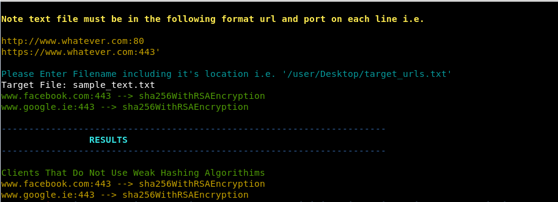

# SSL Cert Using Weak Hashing Algorithim

### Description

Tool to check if a target sites ssl certificate are signed using a weak hashing algorithim.

### What Is This Important

If a remote service uses an SSL certificate chain that has been signed using a cryptographically weak hashing algorithm, it may allow a hacker to forge there certificate. These signature algorithms are known to be vulnerable to collision attacks. Meaning an attacker can exploit this to generate another certificate with the same digital signature, allowing an attacker to masquerade as the affected service

### Launching the program

To use the program simply open up a terminal navigate to the directory and run it with "./ssl_cert_signed_using_weak_hash_algo.py"

### How To / Program Features

The program has two options. It can either can a single url, or a list of target urls. 
To scan a single url you must include the full url and port number. For example https://www.samplesite.com:443
To scan a text file containg urls, the file must be formatted as follows. Each url must be on a new line and with the following format https://www.samplesite.com:443. 
A sample text file ahs been included also. 

The logic behind the porgram is that it will connect to a given url with a vulnerable 64 bit cipher. If the connection is successful then it is assumed that the target is vulnerable. If it is unsuccessful then it is assumed that it's not.

### Screenshots

### Built With

* Python 2.7.14 --> Custom Build Of OpenSSL

### Authors

*** Zach Fleming --> zflemingg1@gmail.com

