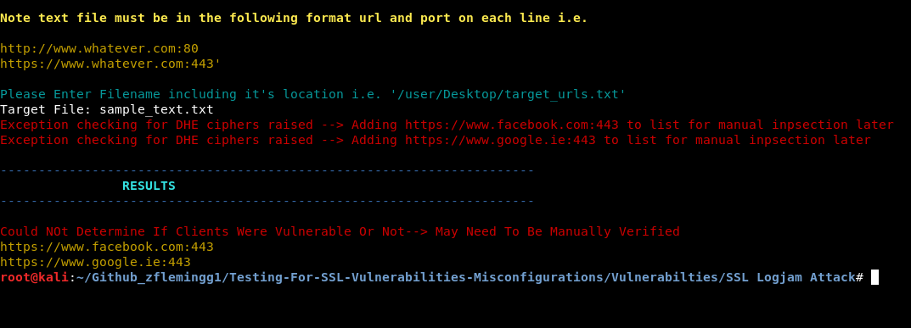

# SSL LogJam Detector

### Description

Tool to check if a target site supports ssl cipher that is vulnerable to the LogJam attack.

### What Is this important

If a remote service uses SSL Ciphers that are vulnerable to the logjam attack it poses a risk to the connection being intercepted. The Logjam attack allows a man-in-the-middle attacker to downgrade vulnerable TLS connections to 512-bit export-grade cryptography. This allows the attacker to read and modify any data passed over the connection.

### Launching the program

To use the program simply open up a terminal navigate to the directory and run it with "./ssl_logjam_attack.py"

### How To / Program Features

The program has two options. It can either can a single url, or a list of target urls. 
To scan a single url you must include the full url and port number. For example https://www.samplesite.com:443
To scan a text file containg urls, the file must be formatted as follows. Each url must be on a new line and with the following format https://www.samplesite.com:443. 
A sample text file ahs been included also. 

### Screenshots

### Built With

* Python 2.7.14 --> Custom Build Of OpenSSL

### Authors

*** Zach Fleming --> zflemingg1@gmail.com

